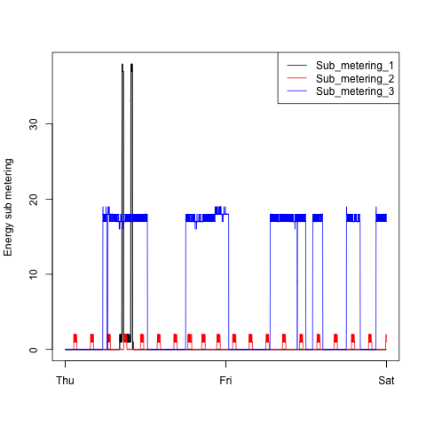
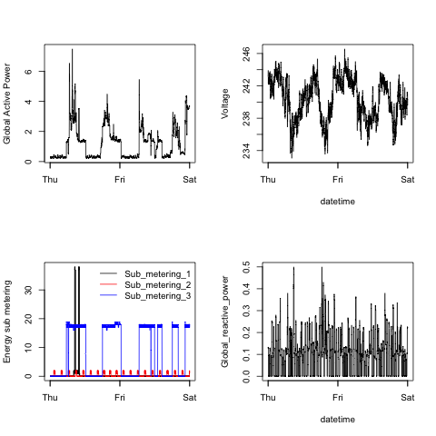

## Introduction

Coursera Exploratory Data Analysis Course Project 1. Original README file from the forked repostory [here](README.original.md).

I have embedded my four charts in this page for easy inspection.

### Plot 1

 

### Plot 2

 

### Plot 3

 

### Plot 4

 
